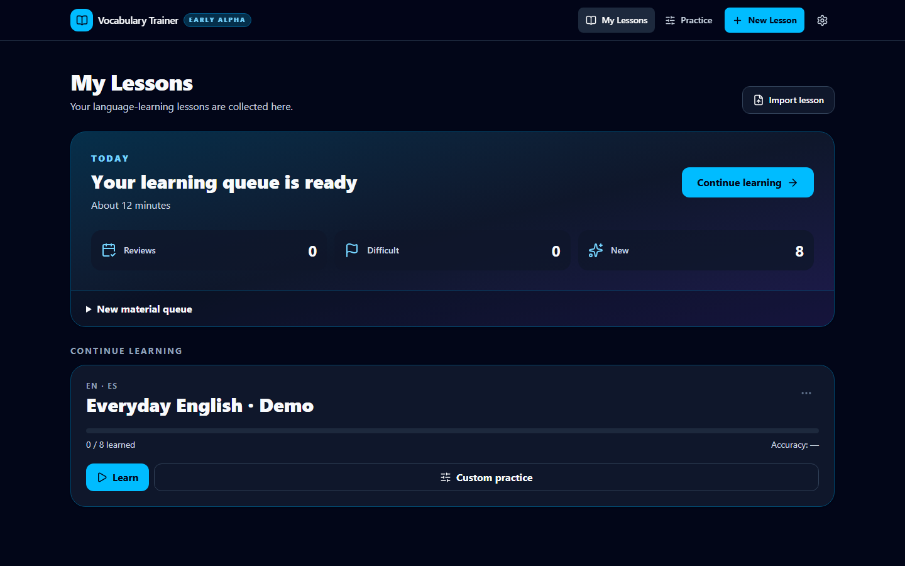

# Vocabulary Trainer

**Adaptive vocabulary practice from your own words.** Vocabulary Trainer is a
local-first early alpha that turns personal vocabulary and media into structured
practice across meaning, images, sound, and exact recall. Mistakes return after
other tasks until the learner can reproduce the word reliably.



## Why it is different

- One word is trained through multiple independent recall skills instead of one
  repeated flashcard.
- Delayed retries bring errors back without exposing the answer immediately.
- Lesson authoring, images, recorded or generated speech, progress, and backups
  work locally without an account or backend.
- Custom practice can combine lessons and target recent errors or manually
  difficult cards without changing Learn progress.
- A built-in, fully offline English demo lesson makes the core flow visible on a
  fresh installation.

**Early-alpha status:** the core learning workflow, lesson authoring, custom
practice, review queue, imports/exports, and portable Windows build are
functional. Authoring polish, voice management, and the Claude-assisted lesson
creation workflow are under active development.

The product landing page lives in [`landing/`](landing/). The application pitch
and prepared Claude for Startups copy live in
[`docs/ANTHROPIC_APPLICATION.md`](docs/ANTHROPIC_APPLICATION.md).

Product behavior is defined in `docs/SPEC.md`; current verification is tracked
in `docs/STATUS.md`.

Russian user documentation and a hands-on test checklist are available in [`docs/USER_GUIDE_RU.md`](docs/USER_GUIDE_RU.md).

## Requirements

- Node.js 22 or newer
- npm
- A current browser with IndexedDB support

## Install and run

On Windows, double-click `start.bat`. It checks for Node.js/npm, installs dependencies when `node_modules` is absent, opens `http://127.0.0.1:5173/`, and keeps the Vite server visible in the command window. It does not change PowerShell execution policy.

From any supported shell:

```bash
npm ci
npm run dev
```

The development server prints its local address when it starts. The optional Japanese offline voice is not required for development or included in the base build.

## Checks

```bash
npm run typecheck
npm run lint
npm test
npm run test:unit
npm run test:integration
npm run test:component
npm run test:e2e
npm run build
```

If Playwright has no browser installed yet, install Chromium once:

```bash
npx playwright install chromium
```

Focused suites are available as `npm run test:unit`, `npm run test:integration`, and `npm run test:component`.

The ordinary E2E run skips the resource-intensive real Japanese model benchmark. Run it explicitly in PowerShell after voice-provider changes:

```powershell
$env:RUN_LOCAL_VOICE_E2E='1'; npm run test:e2e:voice
```

## Production build

On Windows, double-click `build.bat`. A successful build reports the absolute `dist` directory. The equivalent shell commands are:

```bash
npm run build
npm run preview
```

The static production output, web manifest, and generated service worker are written to `dist/`.

## Windows desktop build

Build the Windows x64 desktop application with:

```powershell
npm run desktop:build
```

Outputs:

- `release-0.7.0/win-unpacked/Vocabulary Trainer.exe` — recommended for startup and interaction performance tests; keep the complete `win-unpacked` directory together;
- `release-0.7.0/Vocabulary-Trainer-0.7.0-portable.exe` — one transferable desktop application.

Desktop data is stored beside the executable under `Vocabulary Trainer Data`. Self-contained Lesson files are maintained automatically in its `lessons` subdirectory; optional voice packages are stored in `tts-packages`. The EXE is currently unsigned, so Windows may display an unknown-publisher warning.

The React/Vite source and `dist/` are also the Electron renderer and remain required for Windows builds. They are not a separate legacy browser application; a future Capacitor Android package will reuse the same renderer and domain/data code. Imported Lessons prepare any missing local generated speech before the canonical Lesson file is written and before practice starts.

Desktop checks:

```powershell
npm run desktop:smoke
```

Create clean end-user and source archives without personal application data:

```powershell
npm run package:distribution
```

The archives and their SHA-256 checksums are written to `distribution/`. See `docs/DISTRIBUTION_RU.md` for the Russian distribution guide.

## Browser-dependent capabilities

- System speech requires an installed voice matching the Lesson locale. The app never substitutes a system voice from another language.
- Custom uploaded/recorded audio is fully local. Recording requires MediaRecorder and microphone permission; upload remains available when recording is unavailable.
- The optional Japanese application-voice package runs client-side through a version-pinned Kokoro/Open JTalk provider and provides five selectable voices. In the desktop app it is an explicit download with size/progress/install/delete controls and persists under `Vocabulary Trainer Data/tts-packages`; it is not included in the base build. Practice never downloads model files. Lesson creation generates per-Card audio into IndexedDB. Both full backups and Lesson packages include that generated speech.
- The desktop app automatically maintains self-contained `.vtlesson` files in its portable data directory. Browser builds retain IndexedDB storage and manual export.
- The desktop app offers one optional universal offline translation package for every direction in the canonical language registry. Google Images opens in a sandboxed in-app picker on desktop; manual image upload/drop/paste remains available offline. Images are optional for all Lessons.

## Static HTTPS deployment

Upload the contents of `dist/` to the root of an HTTPS static host. Configure the host to serve `index.html` for unknown navigation paths so client-side routes work on refresh. Hashed assets may be cached long-term; keep `index.html`, `manifest.webmanifest`, and `sw.js` revalidatable so service-worker updates can be discovered. Do not rewrite requests for actual static files to HTML.

The application has no backend dependency or fixed development-server origin. HTTPS is required in production for normal PWA installation, service-worker behavior, microphone access, and folder access.

For a smoke test of the exact deployable files:

```bash
npm run build
npm run preview -- --host 0.0.0.0 --port 4173
```

The preview server is for local verification only. Use an HTTPS static host in production. Lesson files use `.vtlesson`; complete local-data backups use `.vtbackup`. Both are ZIP containers and should be restored only through the in-app Settings screen.
